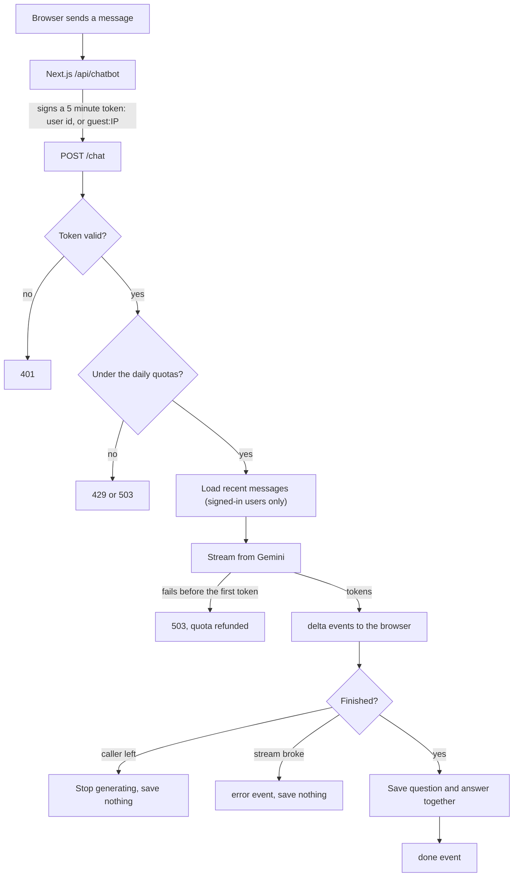

```mermaid
flowchart TD
    A["Browser sends a message"] --> B["Next.js /api/chatbot"]
    B -->|"signs a 5 minute token: user id, or guest:IP"| C["POST /chat"]
    C --> D{"Token valid?"}
    D -->|no| E["401"]
    D -->|yes| F{"Under the daily quotas?"}
    F -->|no| G["429 or 503"]
    F -->|yes| H["Load recent messages (signed-in users only)"]
    H --> I["Stream from Gemini"]
    I -->|"fails before the first token"| J["503, quota refunded"]
    I -->|tokens| K["delta events to the browser"]
    K --> L{"Finished?"}
    L -->|"caller left"| M["Stop generating, save nothing"]
    L -->|"stream broke"| N["error event, save nothing"]
    L -->|yes| O["Save question and answer together"]
    O --> P["done event"]
```
